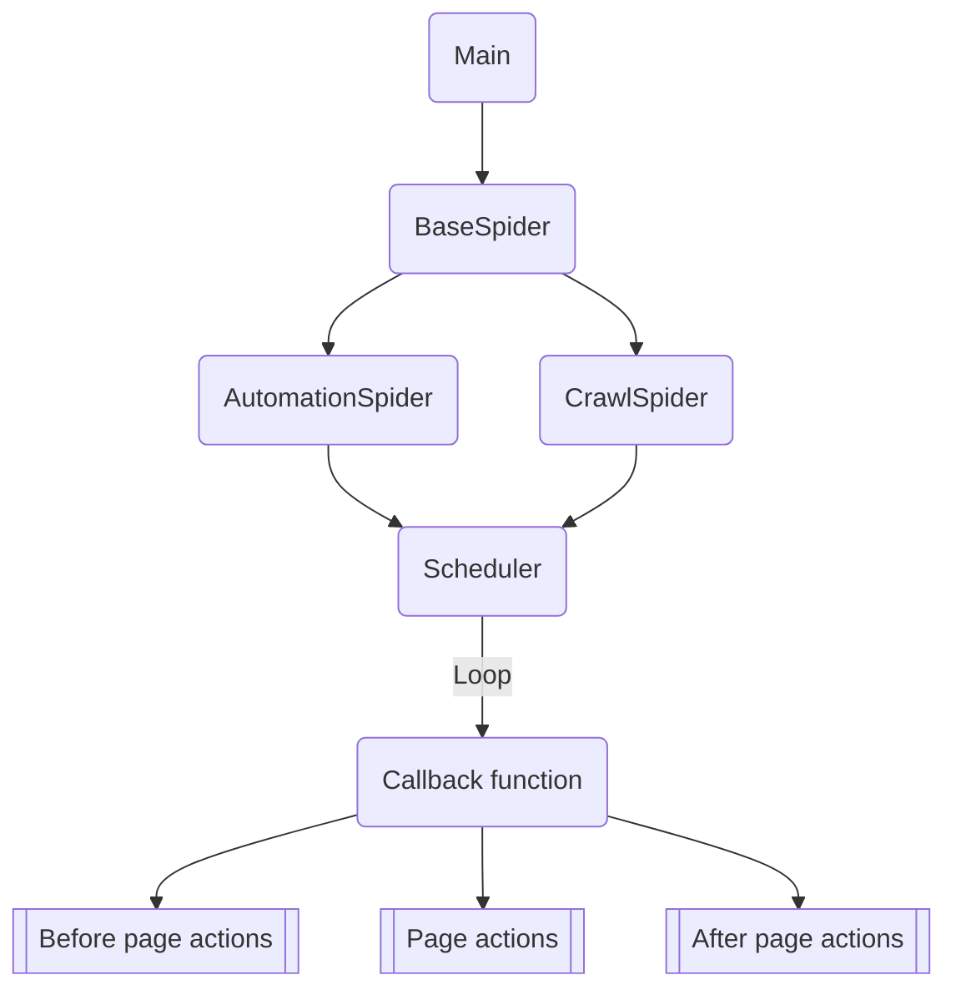

# Prime Spiders

PrimeSpiders is a collection of spiders used for growth marketing and web scrapping.

## Features

* MCP server to manage and coordinate automation spiders.

## Architecture



# Commands

### Start a spider

```Shell

playwright install

python src/primespiders <spider>

# With a specific ID

python src/primespiders <spider> --with-id=1234
```

### Start Fast Api server

```Shell
uv run fastapi run src/primespiders/server/app.py
```

### Start MCP server

```Shell
uv run fastmcp run src/primespiders/server/mcpserver.py
```
